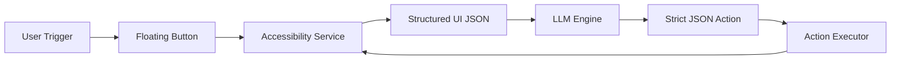
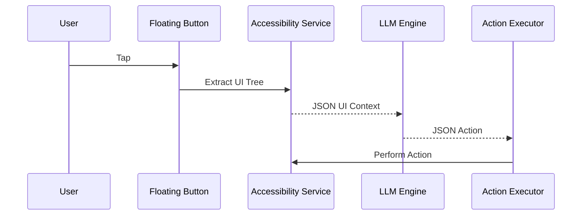

<div align="center">

# 🧠 MiniJarvis

### Offline Android AI Automation Engine


> A fully local AI assistant for Android automation powered by on-device LLM inference.

</div>

---

## ✨ What Is MiniJarvis?

MiniJarvis is an experimental on-device automation engine that:

- Extracts live Android UI via Accessibility API  
- Feeds structured UI to a local LLM  
- Receives strict JSON actions  
- Executes them deterministically  

No cloud.  
No tracking.  
No background spying.

---

## 🏗 System Architecture



---

## 🔬 Execution Flow



---

## 🧩 Core Components

### 1️⃣ UI Extraction Layer
- Uses Android Accessibility API
- Parses visible elements
- Generates structured UI JSON
- Context-aware extraction

---

### 2️⃣ LLM Prompt Engine
- Model: Gemma 2B (4-bit GGUF)
- Context: 1024 tokens
- Temperature: 0.2 (deterministic output)
- Max Tokens: 120
- Strict JSON-only responses

---

### 3️⃣ Action Executor
- Validates actions before execution
- 500ms throttling
- Emergency stop mechanism
- Anti-loop safeguards

---

### 4️⃣ Trigger System
- Floating overlay button
- On-demand inference only
- No continuous background processing

---

## ⚙ Installation

### Build
```bash
./gradlew assembleDebug
```

### Install
```bash
adb install app/build/outputs/apk/debug/app-debug.apk
```

---

## 📥 Model Setup

```bash
wget https://huggingface.co/leliuga/ggml-gemma-2b-v1-q4_0/resolve/main/gemma-2b-v1-q4_0.gguf
cp gemma-2b-v1-q4_0.gguf app/src/main/assets/
```

---

## 🛠 Native Integration (llama.cpp)

```
app/src/main/jniLibs/
    ├── arm64-v8a/libllama.so
    └── armeabi-v7a/libllama.so
```

Built using Android NDK.

---

## 🔐 Required Permissions

| Permission | Purpose |
|------------|----------|
| Accessibility | Read & interact with UI |
| Overlay | Floating activation button |
| Foreground Service | Reliable background execution |
| Battery Optimization Disabled | Stability |

---

## 📂 Project Structure

```
app/
├── ui/
├── service/
├── accessibility/
├── llm/
├── util/
├── model/
├── assets/
└── jni/
```

---

## ⚡ Performance Philosophy

- Model loaded once, reused
- Inference only on user trigger
- Zero network dependency
- Optimized for 4GB RAM devices
- Minimal APK footprint

---

## 🔒 Privacy & Security

- 100% local inference
- No telemetry
- No analytics
- No data collection
- No internet calls

---

## 📈 Roadmap

- [ ] Multi-step reasoning memory
- [ ] Better UI disambiguation
- [ ] Smaller quantized models
- [ ] Voice trigger
- [ ] Action confidence scoring

---

## 🤝 Contributing

1. Fork repository  
2. Create feature branch  
3. Test on real device  
4. Submit PR  

---

## 📄 License

MIT License
