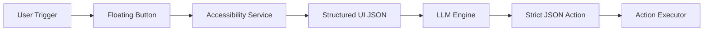
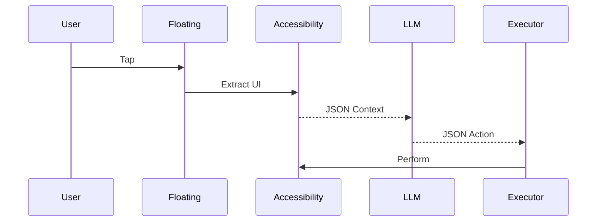

<div align="center">

# 🧠 MiniJarvis
### Offline Android AI Automation Engine


</div>

---

## 🏗 System Architecture

%%{init: {'theme':'dark','securityLevel':'strict','flowchart':{'htmlLabels':false}}}%%


---

## ⚙ Core Overview

<table>
<tr>
<td width="50%" valign="top">

### 🔹 What It Does

- Extracts live Android UI
- Converts UI → structured JSON
- Feeds JSON into local LLM
- Receives strict JSON action
- Executes via Accessibility

No cloud.  
No telemetry.  
No background inference loop.

</td>

<td width="50%" valign="top">

### 🔹 Why It’s Different

- Fully offline inference  
- Quantized Gemma 2B (GGUF)  
- Optimized for 4GB RAM devices  
- Deterministic temperature (0.2)  
- User-triggered only  

Privacy-first architecture.

</td>
</tr>
</table>

---

## 🔬 Execution Flow

%%{init: {'theme':'dark','securityLevel':'strict','sequence':{'htmlLabels':false}}}%%


---

## 📦 Installation & Model Setup

<table>
<tr>
<td width="50%" valign="top">

### Build

```bash
./gradlew assembleDebug
```

### Install

```bash
adb install app-debug.apk
```

</td>

<td width="50%" valign="top">

### Download Model

```bash
wget https://huggingface.co/leliuga/ggml-gemma-2b-v1-q4_0/resolve/main/gemma-2b-v1-q4_0.gguf
cp gemma-2b-v1-q4_0.gguf app/src/main/assets/
```

</td>
</tr>
</table>

---

## 🔒 Privacy Model

- 100% local inference  
- No network calls  
- No analytics  
- No telemetry  
- No external API usage  

---

## 📄 License

MIT
